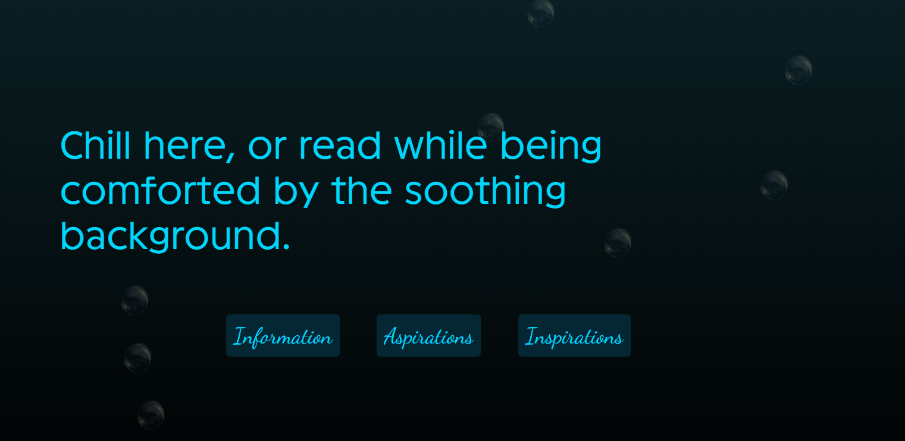

# A very chill introductory page!

## Some background information... :>
Hello! My username is [@Pammmmaela](https://github.com/Pammmmaela). You can call me **Pam**!
This is a website that is hosted by GitHub's Pages, an easy and wallet-friendly way to let people try your website without pulling from its original source code. In this website, you can chill and listen to the looping music, or choose to click on any of the three buttons to know more about me! 🎶🎵🎧

The theme of the website is inspired by my affinity to blue colours. Mixed with deep-sea aesthetic that caters to marine lovers! 🫧🌊 Though, no animals are included in this one. This website mimics how an ocean park feels like but in your screen! 🪼😁

If you like it, it will be much appreciated if you can rate this website project on Hack Club's [Stardance](https://stardance.hackclub.com/). A non-profit program open for ages 13-18 who would like to showcase their projects, whether software or hardware, or both! Oh wait, my project's link is [this](https://stardance.hackclub.com/projects/44205). Thank you!!! :DDD

## New Additions! (Yippie!!!!)
Added SFX for start button 🔊\
Added BGM upon start button 🎧\
Added paragraph-tag buttons for navigation 🧭\
Added date and time display when the page was accessed 🕧\
Added bubbles/air pockets for a deep-sea effect! 🫧\
3/3 pages done! 🌐

## Challenges :<
All complete! :d